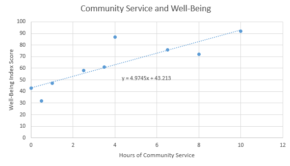
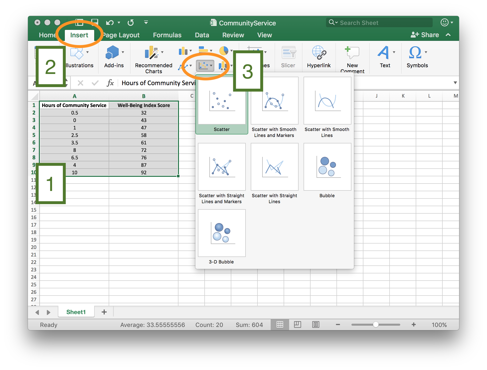
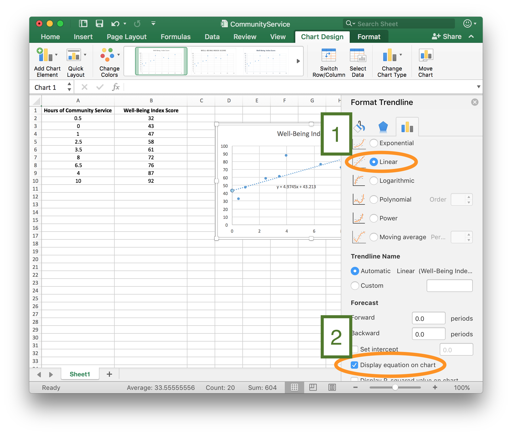
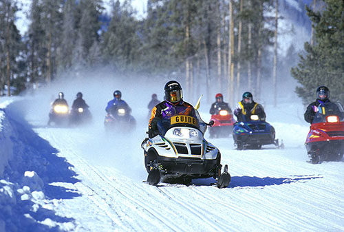

```{r, include=FALSE}
library(ggformula)
library(mosaic)
library(plotrix)
```

## Opening Story 

<center><iframe id="kaltura_player" src="https://cdnapisec.kaltura.com/p/1157612/sp/115761200/embedIframeJs/uiconf_id/29018071/partner_id/1157612?iframeembed=true&playerId=kaltura_player&entry_id=0_3gbhhyat&flashvars[streamerType]=auto&amp;flashvars[localizationCode]=en&amp;flashvars[leadWithHTML5]=true&amp;flashvars[sideBarContainer.plugin]=true&amp;flashvars[sideBarContainer.position]=left&amp;flashvars[sideBarContainer.clickToClose]=true&amp;flashvars[chapters.plugin]=true&amp;flashvars[chapters.layout]=vertical&amp;flashvars[chapters.thumbnailRotator]=false&amp;flashvars[streamSelector.plugin]=true&amp;flashvars[EmbedPlayer.SpinnerTarget]=videoHolder&amp;flashvars[dualScreen.plugin]=true&amp;&wid=0_qfnz9gt9" width="608" height="350" allowfullscreen webkitallowfullscreen mozAllowFullScreen frameborder="0" title="Kaltura Player"></iframe>

Lesson 10 - Opening story<br> [(0:54 mins, L10 Opening Story Transcript)](https://docs.google.com/document/d/e/2PACX-1vTMmLClXg20NeGKV5-4w026dP8axcsh_C2rGAqztUY7XX7lYw-XcAyU6PAwHHXrGCQJn18847VFXyK-/pub)


</center>


## Introduction

As Sophia and Emmy traveled through Yellowstone National Park (USA) they encountered situations where *data analysis* was used to make a decision or a prediction. 

> Data analysis is the method of collecting, graphing, and analyzing data in order to understand patterns in the data.

In other words, data analysis is used to uncover the truth about a current scenario, a future event, or even what happened in the past. 

Elder Bednar stated, "I long have been impressed with the simple and clear definition of truth set forth in the Book of Mormon: The Spirit speaketh the truth and lieth not. Wherefore, it speaketh of things as they really are, and of things as they really will be; wherefore, these things are manifested unto us plainly, for the salvation of our souls."[^1]

While we live in a time where God has revealed many truths, there are still many things that God has not yet revealed. As individuals, our futures are still full of uncertainty. This lesson focuses on analyzing data to make prediction, which gives us quantitative tools to better understand things "as they really are" and predict things "as they really will be." [^2]


## Input and Output Variables

One of the most powerful ways to discover how things "really are" is to use known information to help predict, or explain the unknown. This is done using input and output variables, as we have discussed in earlier lessons. 

Mathematicians and statisticians use a variety of different names to refer to input and output variables. We will continue to refer to these variables as inputs and outputs. But it can be helpful to know their other names. 

| Input Variable | Output Variable |
|----------------------|-------------------|
| $x$-variable  |  $y$-variable |
| independent variable | dependent variable |
| explanatory variable | response variable |
| predictor variable | response variable |


We have seen several examples of input and output variables in previous lessons.  In Lesson 8 we read about Sarah, a woman who was trying to improve her health. She used the function $f(x)=6x+1860$ where the input variable, $x$, represented the number of minutes she walked each day and the output variable, $f(x)$ or $y$, represented her total caloric expenditure for the day. The total number of calories burned changed in *response* to how long she walked, and how long she walked *explained* or *predicted* how many calories she would burn. Said differently, she was free (or *independent*) to choose how long she walked, while the total number of calories burned was *dependent* on her choice of how long she walked. This is just an example of how the alternative names of input and output variables could be used. As stated previously, this lesson will continue to use only the terms "input" and "output" for variables.

When it is possible two variables might be related, we can use data analysis to explore relationships between the input variable and the output variable. We can create a scatter plot with the input variable on the horizontal axis ($x$-axis) and the output variable on the vertical axis ($y$-axis).  Looking at the scatter plot helps us see if a pattern or trend exists that can be described using a function.

## Trendlines

When data shows a pattern or trend, we can use the data to make predictions. The predictions may be about some future event, an estimate of what happened in the past, or even a statement about where things are currently. We often use trendlines to describe a trend or correlation in data.

> A *trendline* is the graph of a function that describes the pattern or trend in data represented by input and output variables.

Although the term *trendline* includes the word "line", trendlines are not always lines, they can also be curves.  We will be using linear trendlines, quadratic trendlines, and exponential trendlines.

### Community Service Example

A study conducted in 2014 showed that "Americans who actively work to better their communities have higher overall well-being than those who do not." [^3] Although the actual data of the study is confidential and cannot be shared here, the following data is recreated to reflect the results of the actual study. This fabricated data shows the score earned by 10 fictitious individuals on a well-being index along with the number of hours of community service they have completed in the past month.

<center>

| Well-Being Index Score (Scale of 0-100) | Hours of Community Service Completed in the Past Month |
|--------------------|------------------|
| 32 | 0.5 |
| 43 | 0 |
| 47 | 1 |
| 58 | 2.5 |
| 61 | 3.5 |
| 72 | 8 |
| 76 | 6.5 |
| 87 | 4 |
| 92 | 10 |

</center>


To study the trend shown by this data we use Excel to create a scatter plot. We decide if the trend is linear, quadratic, or exponential and then add the appropriate trendline and equation to the graph.

<center>


</center>
<br>
<br>
Looking at the graph, we can see that all the points don't lie directly on the line. However, the line does show the general trend of the data. In this case, Excel tells us the general relationship between the Well-Being Index Score and the Hours of Community Service can be described with the function

$$
y=4.9745x+43.213
$$

where the input, $x$, represents the number of hours of community service completed in the past month and the output, $y$, represents the score on the well-being index.

We can use this function to predict the well-being score for individuals, based on the number of hours of community service they have completed in the previous month.

For individuals who have completed 10 hours of community service in the past month,

$$
y=4.9745(10)+43.213=92.958.
$$

For individuals who have completed 5 hours of community service in the past month, 

$$
y=4.9745(5)+43.213=68.0855.
$$
The prediction is that on average, individuals who complete 10 hours of community service will have a higher well-being score than individuals who complete 5 hours of community service.

### Excel Instructions - Trendlines {.tabset .tabset-fade}
Click on each of the five steps below to learn how to create the community service scatter plot and trendline.

#### Step 1
Create an Excel file that lists the input variable in the first column and the output variable in the second column.


<hr>

#### Step 2

[1] Highlight the data you want to graph, then 

* [2] Select "Insert".
* [3] Select the "Scatter plot" icon and the "Scatter option".



<hr>

#### Step 3
Once the scatter plot has been created,

* [1] Right-click on one of the points.
* [2] From the right-click menu, select "Add Trendline"


<hr>

#### Step 4
From the "Format Trendline" menu, 

* [1] Because the scatter plot for these data show a linear trend, select "Linear". (Select "Polynomial" to create a quadratic trendline or "Exponential" to create an exponential trendline.)
* [2] Check the box to "Display Equation on Chart".



<hr>

#### Step 5

Add chart elements [1], such as axis titles and chart titles to create a finished graph [2].


<hr>

### Practice Creating Trendline

<center>
<div>
<iframe width=780 height=600 frameborder="0" src="./Lesson10/Storyline/Lesson10.Interactive2 - Storyline output/story_html5.html" style="-webkit-transform:scale(0.8);-moz-transform-scale(0.8);" align="center"></iframe>
</div>

L10 - Interactive 1: Practice Creating Trendline<br> [(L10-1 ADAInteractive Transcript)](https://docs.google.com/document/d/e/2PACX-1vRHccyt3J_Zjx6jQfadTmKKYM-AEcyD-DkpQkcDPNSK4D8MySwkKwqlKK95p1C1xIGFd9OGV7pN-zUg/pub)


</center>

<hr>

## Correlation vs Causation

In chapter 2 we learned about flaws in logical reasoning. If we are not careful, the use of trendlines can lead to a very common flaw in logical reasoning.

When a scatter plot shows a trend or relationship between two variables we say that the variables are *correlated*. However, this does not necessarily mean that changes in the input variable *cause* a change in the output variable. 

> A correlation between two variables does not imply there is a causal relationship.

A causal relationship means that changes in one variable *cause* a change in the other variable. Often, when variables are correlated there is an alternative explanation, other than causation, for the relationship. Here are a few examples.

#### Lice: A Sign of Good Health

<br>

<center><iframe id="kaltura_player" src="https://cdnapisec.kaltura.com/p/1157612/sp/115761200/embedIframeJs/uiconf_id/29018071/partner_id/1157612?iframeembed=true&playerId=kaltura_player&entry_id=0_by427lro&flashvars[streamerType]=auto&amp;flashvars[localizationCode]=en&amp;flashvars[leadWithHTML5]=true&amp;flashvars[sideBarContainer.plugin]=true&amp;flashvars[sideBarContainer.position]=left&amp;flashvars[sideBarContainer.clickToClose]=true&amp;flashvars[chapters.plugin]=true&amp;flashvars[chapters.layout]=vertical&amp;flashvars[chapters.thumbnailRotator]=false&amp;flashvars[streamSelector.plugin]=true&amp;flashvars[EmbedPlayer.SpinnerTarget]=videoHolder&amp;flashvars[dualScreen.plugin]=true&amp;&wid=0_yf7t25u5" width="608" height="350" allowfullscreen webkitallowfullscreen mozAllowFullScreen frameborder="0" title="Kaltura Player"></iframe>

Correlation/Causation<br> [(2:37 mins, L10 Eyring Transcript)](https://docs.google.com/document/d/e/2PACX-1vTy79ft5DaT6FIIAoHfHIETWkwLxga_jbgVafpWbA1SxRaHCCV5rWJZb40ve9y8rEE49l-JRBbH0oee/pub)


</center>

<br>

As explained by President Eyring, it is easy to assume a casual relationship when none exists.  

#### Eating Ice Cream Causes Shark Attacks!

Here is another classic example. The following scatter plot and trendline show the relationship between monthly ice cream sales and the number of shark attacks per month.[^10]

<center>


</center>

This scatter plot clearly shows a linear trend where increased monthly ice cream sales correspond with a high number of shark attacks. However, what we are seeing in the graph is a *correlation* between ice cream sales and shark attacks.  We cannot conclude that eating ice cream *causes* shark attacks. 

The correlation seen in these data has a more rational explanation. Because of warmer weather, people are more likely to eat ice cream in the summer than they are in the winter. So ice cream sales are higher during summer months.  Similarly, warmer weather during the summer means that people are more likely to go to the ocean and go swimming.  Due to there being more people in the water, as well as because of the migratory patterns of sharks, shark attacks are more common during the summer than in the winter.  So the relationship between ice cream sales and shark attacks is due to the fact that both are more common during summer months when the temperature is warmer. This *alternative explanation* explains the trend we see in the data.

In the case of sharks and ice cream, it is pretty obvious that we should look for an alternative explanation. However, no matter what the data represents, we should always remember that seeing a correlation or trend in the data does not tell us that there is a causal relationship where changes in one variable *cause* a change in the other variable. Here is an example where it is more tempting to say a causal relationship exists. We first saw this example in Lesson 3. 

#### Soda Leads to Heart Attacks

A research study published in 2013 examined the effect that drinking soda (or other sugary drinks) has on cardiovascular health. The data examined in this study showed a trend where men who drank more soda had higher risk of having a heart attack. However, as stated in a CBSNews article reporting on the study, "other doctors caution that just because there may be a link between sugary drinks and heart attacks does not mean sugar is causing them."[^11] The article went on to point out that men who drink sugary drinks often consume them along with burgers, fries, and other unhealthy food choices. Having a generally unhealthy diet and other poor health habits may be the actual cause of increased heart attack risk. 

#### Community Service and Well-Being

We should apply the rule that correlation does not imply causation to the community service example from the previous section. This example shows a trend where people who do more community service tend to have higher scores on a well-being index. However, we cannot conclude that it is the community service that *causes* them to have better well-being. We just know there is a correlation and that an individual who does more community service  is more likely to have a higher score on the well-being index.  It might be the community service that causes a feeling of well-being, but there might also be an alternative explanation. The information we have been given is not enough to tell.

## Linear, Quadratic, or Exponential?

Excel can create linear, quadratic, and exponential trendlines. To decide which of these three types of trendlines would apply in a particular situation we look at the shape of the scatter plot. If the general shape of the points are close to being a line, we use a linear trendline. If the general shape of the graph resembles a u-shaped parabola, we use a quadratic trendline. If the general shape is non-linear and increasing (or decreasing), we use an exponential trendline.

Linear trendlines are used with data that is linear and has a constant rate of change. Quadratic and exponential trendlines are used with data that is non-linear and has a variable rate of change.

<center>
<div>
<iframe width=780 height=700 frameborder="0" src="./Lesson10/Storyline/Lesson10.Interactive1 - Storyline output/story_html5.html" style="-webkit-transform:scale(0.8);-moz-transform-scale(0.8);" align="center"></iframe>
</div>

L10 - Interactive 2: Linear, Quadratic, or Exponential?<br> [(L10-2 ADA Interactive Transcript)](https://docs.google.com/document/d/e/2PACX-1vSRUau00VzEJLf3ySGj3H9K_3PqXaHxu98GtU6zWnGBysDXBVKMWTfzq9Et7N7ExoPfwCZn1_WcJ3lP/pub)


</center>


<hr>

#### Writing Exponential Functions

Because of the rules of exponents (that we reviewed in Lesson 1), exponential functions can be written a variety of different ways.  For example,

$$
\begin{align}
f(x)&=2^{-x}\\
&=2^{-1\times x}\\
&=(2^{-1})^x\\
&=\bigg(\frac{1}{2}\bigg)^x\\
\end{align}
$$
Therefore, even though the equations $f(x)=2^{-x}$ and $f(x)=\big(\frac{1}{2}\big)^x$ look different from one another, they represent the same function and have the same graph.

Excel uses the exponential number $e$ when giving the equation for an exponential function. The exponential number $e$ is a constant that is approximately equal to 2.7182. Like $\pi$, the exponential number $e$ is a non-terminating, non-repeating decimal. Because $e$ is a number that shows up naturally in a variety of applications, it was given a special name and symbol. 

We can use the rules of exponents to show that $f(x)=e^{1.098612x}$ and $f(x)=3^x$ are different equations that represent the same function.

$$
\begin{align}
f(x)&=e^{1.098612x}\\
&=(e^{1.098612})^x\\
&=(2.7182^{1.098612})^x\\
&=3^x\\
\end{align}
$$
<hr>


## Predictions from Trendlines

Creating a scatter plot and trendline gives us a function to describe the relationship between two variables. We can use this function to make predictions. The following example demonstrates how we could use predictions from trendlines as part of the Quantitative Reasoning Process.


<h4 class="step one">
Understand the Problem
</h4>

Olivia has a 10 year old Honda Civic. It is completely paid for so Olivia has been saving money each month for the purchase of her next car. She currently has $10,500 saved to purchase a new car.

<center>

</center>

<br>
<br>

The new car Olivia wants to buy will cost \$18,000, including all taxes and fees. Olivia needs to determine whether she will get enough money from the sale of her old Honda Civic to purchase the new car.


<hr>
<h4 class="step two">
Identify Variables & Assumptions
</h4>

As Olivia considers the variables and assumptions in her situation, she identifies the following key variables:

* The total cost of the new car.
* The condition of the Honda Civic she is selling.
* The amount of money she will get from selling her Honda Civic.

She realizes she is making the following assumptions:

* She will pay cash for her new car and not borrow any money.
* She can use all the money from the sale of the Honda Civic for the purchase of her new car.
* She can buy a new car for $18,000.
* She has \$10,500 to use to purchase her new car.
* If she can sell her Honda Civic for at least \$7500, she can purchase the new car.


<hr>
<h4 class="step three">
Apply Quantitative Tools 
</h4>

Olivia knows she needs to be able to sell her 10 year old Honda Civic for at least \$7500. She finds several Honda Civics for sale, but none of them are the same year as hers, so she isn't sure how much she will earn from the sale of her old car. Olivia creates a spreadsheet listing the age and sale price of Honda Civics in her area with similar features and condition as her Honda Civic. 

The scatter plot shows how the value of the Honda Civic changes over time. After looking at the scatter plot, Olivia realizes the data is non-linear so she decides to use an exponential trendline to describe the relationship between the age and sale price of Honda Civics.


From the scatter plot shown above, we see that the function relating age and sale price of Honda Civics is

$$
y=18422e^{-0.1x}
$$
where $x$ represents the age of the car and $y$ represents the sale price.

Olivia uses this equation to predict the amount of money she will get from selling her 10-year old car:

$$
y=18422e^{-0.1(10)}=\$6777.08 
$$

Rounding up, Olivia concludes that she will be able to sell her car for around $6800. However, she realizes that this prediction gives an average price and that there will be variation in the selling price of Honda Civics. So she might be able to sell her car for a little more or a little less than this predicted price.

<hr>
<h4 class="step four">
Make an Informed Decision
</h4>


Because Olivia has \$10,500 saved, if she sells her car for \$6800 she would have a total of \$17,300.  However, Olivia knows she needs at least \$18,000 for the new car she wants to purchase. She will likely be about \$700 short of the amount she needs to purchase the new car. She decides to wait to sell her car until she has saved more money.

<hr>
<h4 class="step five">
Evaluate Your Reasoning
</h4>

As Olivia reflects on her decision, she is disappointed. Because she was excited to purchase the new car, she looks again at the new car options. She finds a less expensive car that she likes and that will meet her needs. Since the alternative car is only $16,000 it fits within her current budgeted amount. She revises her decision and goes ahead and puts her Honda Civic up for sale. She lists the sale price as \$7,800 so she still has room to negotiate with potential buyers about the price.

<hr>

### Practice Making a Prediction

<center>
<div>
<iframe width=780 height=600 frameborder="0" src="./Lesson10/Storyline/Lesson10.Interactive3 - Storyline output/story_html5.html" style="-webkit-transform:scale(0.8);-moz-transform-scale(0.8);" align="center"></iframe>
</div>

L10 - Interactive 3: Practice Making a Prediction<br> [(L10-3 ADA Interactive Transcript)](https://docs.google.com/document/d/e/2PACX-1vSrkNuRb8TQ6lLBSCsHYLclgTy2eTQ5Un_DvrnPbgvBVTBGx0sKOAv_55DCuCBcqomu0r0v0vN10ihm/pub)


</center>

<hr>

## Example: Old Faithful

In the opening video, we saw that Sophia and Emmy predicted the time of the next eruption of Old Faithful Geyser. Old Faithful is one of the most famous features of Yellowstone National Park. The [park's website](http://www.yellowstonepark.com/about-old-faithful/) boasts that Old Faithful is "the most famous geyser in the world". 

Old Faithful is named for its predictable eruptions. Visitors to the park come from all over the world to see the eruption of Old Faithful.[^4] The geyser is so predictable that the park actually posts signs letting visitors know how many minutes until the next eruption. Most other geysers in Yellowstone and elsewhere erupt less frequently and their eruptions are much more difficult to predict.

The scatter plot below shows how the park uses the length of the previous eruption to determine how long it will be until the next eruption. The scatter plot shows the general pattern found in actual data recorded by researchers for past eruptions. 

<center>
```{r, echo=FALSE}
plot(waiting ~ eruptions, data=faithful, pch=16, col="gray60",
     xlab="Length of Previous Eruption (minutes)",
     ylab="Wiating Time to Next Eruption (minutes)",
     main="Old Faithful Geyser")
```
</center>

Notice that if the previous eruption of Old Faithful lasted for 4.0 minutes, then we would predict the time until the next eruption to be anywhere from 68 to 90 minutes. See the blue points in the plot below. 

The red points in the plot predict that if the previous eruption lasted 2.0 minutes, we would expect a waiting time between 42 and 66 minutes until the next eruption. We can see that the longer the previous eruption lasted, the longer we would expect to wait until the next eruption.

<center>
```{r, echo=FALSE}
plot(waiting ~ eruptions, data=faithful, pch=16, col="gray60",
     xlab="Length of Previous Eruption (minutes)",
     ylab="Wiating Time to Next Eruption (minutes)",
     main="Old Faithful Geyser")
a <- .08
m <- 4
col1 <- "skyblue"
points(waiting ~ eruptions, data=subset(faithful, eruptions > m-a & eruptions < m+a), pch=16, col=col1)
rect(m-.9*a, 68, m+.9*a, 90,
     col=NULL, border=col1, lty=1, lwd=1, xpd=FALSE)
lines(c(m,m), c(0,68), lty=2, col=col1)
lines(c(0,m-a), c(68,68), lty=2, col=col1)
lines(c(0,m-a), c(90,90), lty=2, col=col1)
a <- .08
m <- 2
col1 <- "firebrick"
points(waiting ~ eruptions, data=subset(faithful, eruptions > m-a & eruptions < m+a), pch=16, col=col1)
rect(m-.9*a, 42.5, m+.9*a, 66,
     col=NULL, border=col1, lty=NULL, xpd=FALSE)
lines(c(m,m), c(0,42.5), lty=2, col=col1)
lines(c(0,m-a), c(42.5,42.5), lty=2, col=col1)
lines(c(0,m-a), c(66,66), lty=2, col=col1)
```
</center>

If we could fit a mathematical model to the data, then we could create an equation that would allow us to predict the average waiting time to the next eruption based on the length of the current eruption. 

Note that the general trend in the data is linear. This suggests a line would be the most appropriate mathematical model for these data.

<center>
```{r, echo=FALSE}
plot(waiting ~ eruptions, data=faithful, pch=16, col="gray60",
     xlab="Length of Previous Eruption (minutes)",
     ylab="Wiating Time to Next Eruption (minutes)",
     main="Old Faithful Geyser")
faithful.lm <- lm(waiting ~ eruptions, data=faithful)
abline(faithful.lm, col='gray55')
text(2.25,90, "Equation of the Line:")
text(2.3,85, "Y = 33.47 + 10.73X")
```
</center>

The mathematical model we get from this data is given by the equation
$$
  y = 33.47 + 10.73x
$$
where the input variable, $x$, represents the length of the most recent eruption and the output variable, $y$, represents the waiting time to the next eruption. If the most recent eruption lasted 4.0 minutes, then the model would estimate that the next eruption will occur in
$$
  y = 33.47 + 10.73(4.0) = 76.39 \ \text{minutes}.
$$
Park rangers can add 76.39 minutes to the time at which the previous eruption ended, and then [post a sign](http://geysertimes.org/geyser.php?id=OldFaithful) near Old Faithful stating when the next eruption would occur. However, note that as shown in the plot above, the actual waiting time could be anywhere from 68 to 90 minutes. So it would be wise to let visitors know that the eruption time could be a little earlier or a little later than the predicted 76.39 minutes from the end of the previous eruption. 

<hr>

<center>
<div>
<iframe width=780 height=600 frameborder="0" src="./Lesson10/Storyline/Lesson10.Interactive4 - Storyline output/story_html5.html" style="-webkit-transform:scale(0.8);-moz-transform-scale(0.8);" align="center"></iframe>
</div>

L10 - Interactive 4: Example: Old Faithful<br> [(L10-4 ADA Interactive Transcript)](https://docs.google.com/document/d/e/2PACX-1vR5TPixVIv3HO-kfHPTeUVM_B8O8ZpqQKU8qex4bF5EheDi5Tk_04FB5QFFuEbsPcIWm1KTMl5GQkCW/pub)


</center>

<hr>

## Example: Snow Machines in Yellowstone

In the opening video, Sophia and Emmy encountered a park ranger who enforced the rule that their snow machines had the best available technology.  Yellowstone National Park officials have been given the task of conserving natural resources in the park, while at the same time allowing for use of the park by the public. Conservation and public use can be at odds with one another. The use of snow machines in Yellowstone is an example of where there has been a lot of controversy.   

<center>

</center>

<br>

In order to protect the environment in Yellowstone National Park, all snow machines are required to have the best available technology (BAT).[^5] This is because older snow machines have less efficient engines that emit more hydrocarbons and carbon monoxide, which are harmful to the environment. However, restricting the types of snow machines significantly restricts winter access to Yellowstone. 

The officials at the National Park Service used data analysis to help make decisions related to the conservation and use of Yellowstone National Park, such as the use of snow machines. The following example outlines the process used by Yellowstone officials to determine the winter use policy in Yellowstone.

<hr>


<h4 class="step one">
Understand the Problem
</h4>


By the late 1990's the number of snow machines entering Yellowstone during the winter had increased to the point there was a noticeable impact on air quality.[^6] In 1999, an environmental group petitioned the National Park Service and asked them to ban recreational snowmobiling in Yellowstone (and all other National Parks). [^7] In 2000, in response to noticeable impacts on air quality and the request by an environmental group, the National Park Service decided to phase out the use of snow machines in Yellowstone National Park. In 2001, the National Park Service was sued over their proposed ban of snow machines.  Because the National Park Service has a legal mandate to allow for public use of park resources, a federal court overturned Yellowstone's snow machine ban. Yellowstone officials then decided to carry out several studies in order to determine the best way to balance environmental conservation and public use of the park. [^7]
<hr>


<h4 class="step two">
Identify Variables & Assumptions
</h4>

Some of the key variables identified by researchers were:

* The types of vehicles entering the park
* The number of vehicles entering the park
* Hydrocarbon Emissions
* Carbon Monoxide Emissions
* Types of snow machine engine (2-stroke engines, 4-stroke engines, BAT engines)

The researchers made several important assumptions:

* Hydrocarbon and carbon monoxide are harmful to the environment
* Decreasing the number of vehicles entering the park will decrease hydrocarbon and carbon monoxide emissions
* BAT snow machines have lower hydrocarbon and carbon monoxide emissions than non-BAT snow machines
* Traveling with a guide will reduce harmful emissions

<hr>


<h4 class="step three">
Apply Quantitative Tools 
</h4>

Between 2002 and 2011, the National Park Service released eight different reports on the impact of winter use on air quality. You can see a complete list of all of their reports [here](https://www.nature.nps.gov/air/studies/yell/yellAQwinter.cfm). The following explanation shows just a small part of the data examined by Park officials as they used data to make decisions on Park policy.

At the beginning of their research in 2000, researchers compared carbon monoxide and hydrocarbon emissions from different type of vehicles entering Yellowstone. The following bar-chart shows the estimated annual emissions from automobiles, RVs, snow machines, snowcoaches, and buses for 1992 through 1999.[^8]

<center>


</center>

They also looked at pie charts that showed the source of all annual hydrocarbons and carbon monoxide emissions [^8]:

<center>
 

</center>

From the bar chart and the pie chart, it is clear that snow machines are the largest source of these harmful emissions. This led Park officials to decide that, although they should not completely ban the use of snow machines in Yellowstone, changes to the winter use policy did need to occur. 

They gathered data on how the type of engine a snow machine had impacted the carbon monoxide emissions.[^9]  

| Type of snow machine engine | Number of snow machines entering Park | CO (ppm) |
|------------|-----|-----|
| 2-stroke | 20|.36|
| 2-stroke | 22|1.72|
| 2-stroke | 28|2.41|
| 2-stroke |42|3.16|
| 2-stroke |67|4.90|
| 2-stroke |470|25.73|
| BAT | 110|3.20|
| BAT |140|2.78|
| BAT |160|3.02|
| BAT |470|4.89|
| BAT |701|7.64|
| BAT |2750|24.19|

In order to test their assumption that snow machines with the best available technology (BAT) have lower emissions than older snow machines with 2-stroke engines, they created a scatter plot of these data and created trendlines for each type of snow machine.

<center>

</center>

Comparing the slopes of these two lines gave helpful information on how the two different types of snow machines are related to carbon monoxide emissions.

For snow machines with 2-stroke engines (older technology), the slope of the line is 0.0538. This tells us:

$$
\text{slope}=\frac{\text{change in y}}{\text{change in x}}=\frac{\text{change in carbon monoxide}}{\text{change in number of snow machines}}=\frac{0.0538 \text{ ppm}}{1 \text{ snow machine}}
$$
Each 2-stroke engine adds 0.0538 ppm of carbon monoxide. Similarly, since the slope of the line for BAT engines is 0.0081, we know BAT engines add 0.00081 ppm of carbon monoxide. Because these numbers are small they are hard to compare. If we multiply them each by 1000, we see that 1000 2-stroke engines would add 53.8 ppm of carbon monoxide while 1000 BAT engines would only add 8.1 ppm of carbon monoxide. 


<hr>
<h4 class="step four">
Make an Informed Decision
</h4>

Based on these calculations (and others that are not shown here), Park officials developed a new policy for winter use in Yellowstone. In 2003 and 2004 they put new winter use restrictions in place. They were again sued over these plans because they restricted winter use in Yellowstone. They again did more research and in 2007 they completed a new plan that allowed for 540 commercially guided, BAT snow machines and 83 snowcoaches to enter the Park each day. [^7]


<hr>
<h4 class="step five">
Evaluate Your Reasoning
</h4>


Between 2007 and 2013 the Park reevaluated their winter use plan several more times. Some of the reevaluation occurred as a result of further suits filed in federal court and some of the reevaluation was based on public comment and input.  
In 2011, Park officials gathered data that compared data collected on the number of winter vehicles entering the Park through the West Entrance and carbon monoxide measurements taken near the entrance.  

This scatter plot shows how the number of winter vehicles correlated to carbon monoxide measurements. There is a strong linear relationship that shows that when more cars enter the park, carbon monoxide measurements also increase.[^9]

<center>

</center>

The following graph shows a bar chart and a time series plot overlayed on top of each other.  It shows how the number of winter vehicles and carbon monoxide measurements have changed over the time period the Park has been changing their policy.[^9]

<center>

</center>

These graphs clearly show that the changes made in 2003-2011 are helping reduce carbon monoxide emissions in the Park.

In 2013 they revised their policy again based on further study. One common criticism of the plan prior to 2013 was that the public was not allowed to enter the Park unless they were with a commercially guided tour. Also, the management plan allowed 83 snowcoaches per day, but on some days fewer than 83 snowcoaches entered the Park while snow machine users were turned away.

Park officials revised their guidelines to allow for flexibility in the ratio of snow machines and snow coaches. If fewer snowcoaches enter the park on a given day, they are now able to allow more snow machines to enter.  They also added an option for one non-commercially guided group to enter the Park each day. 

You can read all of the details of Yellowstone National Park's current [winter-use policy](https://www.nps.gov/yell/learn/management/currentmgmt.htm) on their website.

<hr>

Most of the examples of the Quantitative Reasoning Process have shown how it can be used by individuals to make decisions about their personal and family lives. This example shows how the Quantitative Reasoning Process was used by the National Park Service.  The Quantitative Reasoning Process is commonly used by businesses, government agencies, non-profit organizations, communities, and other organizations. Scientists, mathematicians, statisticians, business people, and other professionals use the Quantitative Reasoning Process to help them make decisions in their work.

<hr>

## Lesson Checklist

```{r, child = "Lesson10Checklist.Rmd"}

```

## Optional Resources

Paragraph 10-13 of [this conference talk](https://www.lds.org/general-conference/2012/04/that-the-lost-may-be-found?lang=eng) given in April 2012 by Elder M. Russell Ballard include an interesting example of cause and effect.

The following video shows more about the research done to establish a causal relationship between smoking and lung cancer.  

<center>
<iframe width="560" height="315" src="https://www.youtube.com/embed/6RzDMEW5omc" frameborder="0" allow="autoplay; encrypted-media" allowfullscreen></iframe></center>

<center>
(03:37 mins, ["Joy of Stats" Transcript](https://docs.google.com/document/d/e/2PACX-1vTZ32RRNvuUdibAFPatWmYNUrQT6BnHaW_wrNpzlWHRnRjytpVXcG5m23FhEwApJt4UR6Q2bmptJRlI/pub); ["Joy of Stats" Captioned Link](https://video.byui.edu/media/Lesson+10_+Joy+of+Stats/0_lhfyqcgo))
</center>

[^1]:  [Elder Bednar](https://www.lds.org/liahona/2010/06/things-as-they-really-are?lang=eng)
[^2]:  Jacob 4:13
[^3]:  http://www.gallup.com/poll/174785/americans-serving-communities-gain-edge.aspx?utm_source=add_this&utm_medium=addthis.com&utm_campaign=sharing#.U-pK7uNhqns.twitter 
[^4]:  The Old Faithful Geyser is only a 2.5 hour drive from the BYU-Idaho campus.  You can watch a live webcam of Old Faithful [here](https://www.nps.gov/features/yell/webcam/oldfaithfulstreaming.html). 
[^5]:  https://www.nps.gov/yell/planyourvisit/newbatlist.htm
[^6]: https://www.nature.nps.gov/air/studies/yell/yellAQwinter.cfm
[^7]: https://www.nps.gov/yell/learn/management/timeline.htm
[^8]: https://www.nature.nps.gov/air/Pubs/pdf/yell/Snowmobile_Report.pdf
[^9]: https://www.nature.nps.gov/air/Pubs/pdf/yell/2009-2011_YELL_WinterAQ.pdf
[^10]: https://swflreia.com/2017/05/17/ice-cream-sales-cause-shark-attacks/
[^11]: http://www.cbsnews.com/news/soda-a-day-may-lead-to-heart-attacks-in-men/


<center>
&copy; 2020 Brigham Young University - Idaho
</center>

