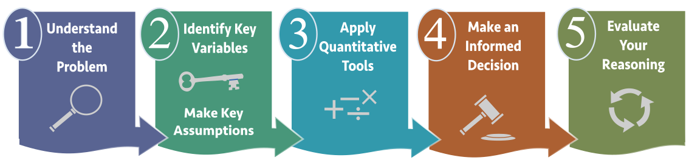
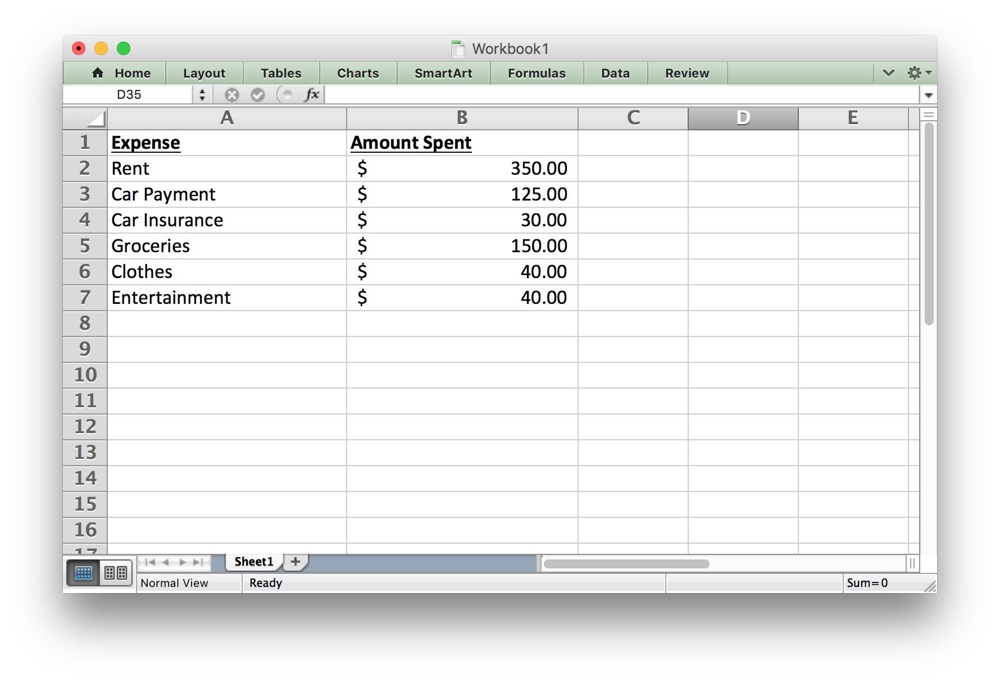

## Opening Story 

<center><iframe id="kaltura_player" src="https://cdnapisec.kaltura.com/p/1157612/sp/115761200/embedIframeJs/uiconf_id/29018071/partner_id/1157612?iframeembed=true&playerId=kaltura_player&entry_id=0_79bzriyq&flashvars[streamerType]=auto&amp;flashvars[localizationCode]=en&amp;flashvars[leadWithHTML5]=true&amp;flashvars[sideBarContainer.plugin]=true&amp;flashvars[sideBarContainer.position]=left&amp;flashvars[sideBarContainer.clickToClose]=true&amp;flashvars[chapters.plugin]=true&amp;flashvars[chapters.layout]=vertical&amp;flashvars[chapters.thumbnailRotator]=false&amp;flashvars[streamSelector.plugin]=true&amp;flashvars[EmbedPlayer.SpinnerTarget]=videoHolder&amp;flashvars[dualScreen.plugin]=true&amp;&wid=0_yf1jgjx4" width="608" height="350" allowfullscreen webkitallowfullscreen mozAllowFullScreen frameborder="0" title="Kaltura Player"></iframe>

Lesson 7 - Opening story<br> [(3:11 mins, L7 Opening Story Transcript)](https://docs.google.com/document/d/e/2PACX-1vQZWZXtEISWgSrEhiuZ8VSCe82h4XtuLYkXv8sAAK7wFLLjuzXdF2rlCDESYP0h3rFaT3URzvkdEhKW/pub)


</center>

## Introduction

Like Craig, there are many reasons why you may need to borrow money at some point in your lifetime.  A loan can provide funds for you to purchase a home, buy a car, get an education, or start a small business without the delay that would be caused by saving the necessary money. However, planning ahead and saving money prior to a purchase can help us avoid borrowing money unnecessarily. 

Our church leaders have counseled us to be wise in how we manage our personal finances and to avoid debt.

> "Look to the condition of your finances. Discipline yourself in your purchases, avoiding debt to the extent you can. In most cases, you can avoid debt by managing your resources wisely. If you do incur debt, such as a reasonable amount in order to purchase a modest home or complete your education, work to repay it as quickly as possible and free yourself from bondage. When you have paid your debts and accumulated some savings, you will be prepared for financial storms that may come your way. You will have shelter for your family and peace in your heart." [^1] 

The Quantitative Reasoning Process can be a great tool to help us follow this advice and manage our resources wisely. Contributing money to a savings account can help us acquire finances we need to make purchases. However, if you do need to borrow money, it is essential that you understand the calculations necessary to make an informed decision. In this lesson we will learn about functions and how they can be used as part of the Quantitative Reasoning Process to make informed decisions about savings and loans.



In the following video, Henry J. Eyring, President of BYU-Idaho shares a personal experience he had in following the council of church leaders to get out of debt.

<center>
<iframe id="kaltura_player" src="https://cdnapisec.kaltura.com/p/1157612/sp/115761200/embedIframeJs/uiconf_id/29018071/partner_id/1157612?iframeembed=true&playerId=kaltura_player&entry_id=0_1czhwbpr&flashvars[streamerType]=auto&amp;flashvars[localizationCode]=en&amp;flashvars[leadWithHTML5]=true&amp;flashvars[sideBarContainer.plugin]=true&amp;flashvars[sideBarContainer.position]=left&amp;flashvars[sideBarContainer.clickToClose]=true&amp;flashvars[chapters.plugin]=true&amp;flashvars[chapters.layout]=vertical&amp;flashvars[chapters.thumbnailRotator]=false&amp;flashvars[streamSelector.plugin]=true&amp;flashvars[EmbedPlayer.SpinnerTarget]=videoHolder&amp;flashvars[dualScreen.plugin]=true&amp;&wid=0_apfgh24d" width="608" height="350" allowfullscreen webkitallowfullscreen mozAllowFullScreen frameborder="0" title="Kaltura Player"></iframe>

L07 Eyring <br> [(2:44 mins, L7 Eyring Transcript)](https://docs.google.com/document/d/e/2PACX-1vQJG3s6NzHYu34k4PN0G1X95PA5HY9iUI0y4Tu3TeB5lYPjfU0tjzCenCMC3dRWn_xgjYlibyk4jONs/pub)


</center>


## Functions

*Mathematical functions* are a useful mathematical tool. They provide a way to think about complex situations, such as savings and loans.

> A function is a rule that assigns the input value(s) to a single output value.

It is important to understand that a function deals with inputs and outputs. The function itself provides a way to determine which output corresponds with a given input. Here is an analogy to help explain functions:

<center>
<div>
<iframe width=780 height=650 frameborder="0" src="./Lesson7/Storyline/Lesson7Function - Storyline output/story_html5.html" style="-webkit-transform:scale(0.8);-moz-transform-scale(0.8);" align="center"></iframe>

L07 - Interactive 1: Functions<br> [(L07-1 ADA Interactive Transcript)](https://docs.google.com/document/d/e/2PACX-1vRChJRFlotndhHoXwxHOKbh1qDdDDaFa-0ikeYsM6AdG-A2R3JxYw87wzdhNFCI4CrSEKfBYKU1-yAX/pub)

</div>
</center>

<hr>

Although functions always assign a single output once the input has been chosen, it is possible for a function to have several inputs. For example, the Body Mass Index (BMI) is used to determine if an individual is has healthy body weight. The BMI is calculated using a function with two inputs. If you put your body weight and height into the function as inputs, the output is your BMI. 

<hr>

### "This" is a function of "That"
In English, we often say that one thing *is a function of* something else. Or one variable *depends on* another variable. These phrases relate to the mathematical concept of a function.  For example, suppose someone said one of the following:

* "How well you do on the test is a function of how much time you spend studying."
* "Your starting salary when you graduate depends on your major."
* "The price of a used car depends on the make and model of the car, as well as its age and condition."
* "Your monthly cash flow is a function of your income and expenses."
* "The amount you can borrow for the purchase of a home is a function of your net monthly income."
* "Your Body Mass Index (BMI) depends on your height and weight."
* "What you get out of sacrament meeting is a function of the amount of preparation you do."

These statements all correspond to the mathematical definition of a function.  Each situation includes at least one *input* and an *output*.  The inputs and outputs of each of these statements are summarized in the following table:

<center>
|**Input(s)**  |  **Output**|
|-------- | ---------|
|Time spent studying | How well you do on the test|
|Your college major | Starting salary after graduation|
|Make, model, age, and condition of car | Price of used car|
|Income and expenses | Monthly cash flow|
|Net monthly income | Amount you can borrow for a home|
|Height and weight | Body Mass Index (BMI)|
|Preparation for church | What you get out of sacrament meeting|

</center>

<center>
<div>
<iframe width=780 height=450 frameborder="0" src="./Lesson7/Storyline/Lesson7.Interactive1 - Storyline output/story_html5.html" style="-webkit-transform:scale(0.8);-moz-transform-scale(0.8);" align="center"></iframe>

L07 - Interactive 2: "This" is a function of "That"<br> [(L07-2 ADA Interactive Transcript)](https://docs.google.com/document/d/e/2PACX-1vTwAUhoFL2cy5VP3CQEvNxXIOBk0by8LGbmol0nyqWbDqviz1ReTggI4HVwFT5RsY-NXqdrDOhSdML0/pub)

</div>
</center>
<hr>

### Function Notation

In addition to knowing the inputs and outputs, you need to know the rule associated with each function. In mathematics, we use function notation to write the rules for functions. For example: 

$$
f(x)=5x-2
$$

This function is named $f$. The input is $x$ and the rule to find the output is $5x-2$.  If we used an input of $x=1$, we would get 
$$f(1)=5(1)-2=3.$$ 
We write this as $f(1)=3$. If we used an input of $x=2$, we would get 
$$f(2)=5(2)-2=8.$$ 
This would be written as $f(2)=8$. And so on.


We could use this method to list some of the inputs and outputs for this function.

<center>
<div style="padding-left: 25px; width: 25%;">


|$x$  | $f(x)$ | 
|-----|----| 
|$1$  | $3$  |
|$2$  | $8$  |
|$3$  | $13$  |
|$4$  | $18$  |
|$5$  | $23$  |
|$6$  | $28$  |


</div>
</center>

From the table we see that $f(4)=18$. This means if there is an input of 4, the output is 18.

<center>
<div>
<iframe width=780 height=350 frameborder="0" src="./Lesson7/Storyline/Lesson7.Interactive2 - Storyline output/story_html5.html" style="-webkit-transform:scale(0.8);-moz-transform-scale(0.8);" align="center"></iframe>

L07 - Interactive 3: Function Notation<br> [(L07-3 ADA Interactive Transcript)](https://docs.google.com/document/d/e/2PACX-1vSfy7GMYN73Wq-c2JXcxnPW-DGgl9bNrALFtTQ92E3NoRQPIyiN6nxcSniqxDKz3xMk2FNsjkwSofca/pub)


</div>
</center>

<hr>


### Examples of Functions {.tabset .tabset-fade}

#### Example 1 - One Input
Assume you have a savings account that earns 0.95% interest each year (compounded daily). If you put \$500 into the account initially, the amount of money in your account will grow over time as interest is added to your account. A function for the amount of money in the account after $t$ months is

$$
f(t)=500(1.000026027)^{30.4167t}
$$
(Note: We will learn more about where this function comes from in Week 9. We included a lot of decimal places for this function because, with this particular function, if you round the decimals too much it introduces a lot of rounding error and you lose accuracy.)

Use this function to answer the following questions: a) what is the input of this function, b) what is the output of the function, and c) how much money will you have in your account after 4 years and 2 months?

**Solution**

The account balance is a function of how long the money has been in the account.

a) The input is the number of months the money has been in the account. 
b) The output is the amount of money in the account.
c) If we have had the money in the account for 4 years and 2 months (50 months total), we would use 50 as the input.  The output then tells us the balance of the account:

$$
f(50)=500(1.000026027)^{(30.4167*50)}=$520.19
$$

After 50 months, the account balance is \$520.19, which means we earned $20.19 in interest over the four years and two months.

<hr>

#### Example 2 - Two Inputs
The Body Mass Index (BMI) is a number often used to determine if an individual is a healthy weight.  If $w$ represents your weight (in pounds) and $h$ represents your height (in inches), then the function for finding your BMI is:

$$
f(w,h)=\frac{720w}{h^2}
$$


Use this function to answer the following questions: a) what are the inputs of this function, b) what is the output of the function, and c) what is the BMI of a person who weighs 125 pounds and is 63 inches tall?

**Solution**

In this case, the BMI is a function of height and weight.

a. The inputs of the function are height (in inches) and weight (in pounds).
b. The output of the function is the individual's BMI.
c. To find the BMI of a person who weighs 125 pounds and is 63 inches tall, we evaluate the function with 125 substituted in for $w$ and 63 substituted in for $h$.

$$
f(125,63)=\frac{720\times 125}{63^2}=22.68
$$

A healthy BMI is generally between 19 and 25, so this person would be considered to have a healthy body weight.

(Note: If body weight is measured in kilograms and height is measured in meters, the function is even simpler.  In that case, $f(w,h)=\frac{w}{h^2}$.)

<hr>

### Check Your Understanding

<center>
<div>
<iframe width=780 height=630 frameborder="0" src="./Lesson7/Storyline/Lesson7FunctionsInContext - Storyline output/story_html5.html" style="-webkit-transform:scale(0.8);-moz-transform-scale(0.8);" align="center"></iframe>

L07 - Interactive 4:Check Your Understanding<br> [(L07-4 ADA Interactive Transcript)](https://docs.google.com/document/d/e/2PACX-1vSm3gU6WYUuIos9SW_j46sfmWbdHA2wDqjY-wYDi1v3WX1H4l7vMjMNlIqUs4YGevWBCOXc-LHv304D/pub)


</div>
</center>
<hr>


## Functions in Excel
Throughout the semester we have been using Excel to do computations. Excel uses the function concept to carry out these calculations. Open Excel and create a spreadsheet that matches the spreadsheet shown in the following screenshot:



In this case we will create a function in Excel with several inputs and a single output.  We want the inputs to be: rent, car payment, car insurance, groceries, clothes, and entertainment.  We want the output to be Total Expenses.

We could say that the *Total Expenses* are a function of the amount spent on rent, car payment, car insurance, groceries, clothes, and entertainment.

We can create a function in Excel that will calculate the output for us.  In this case, we will use the *Sum* function. Notice that Excel uses function notation similar to what we would use in mathematics. As shown in the red circle in the following image, we can see that the function *f(x)* is equal to the sum of the entries in cells B2 through B7.  The inputs of the function are $350, $125, $30, $150, $40 and $40.  The rule used for this function is a sum, so we add these numbers together to get the output: $735.00.


This semester we have already seen several other functions that are built into Excel. For example, we have computed the average, the minimum, the maximum, and the standard deviation. These are all examples of functions that are built into Excel.

One purpose in learning about functions is to help us better understand loan calculations. Excel has several built-in functions that will be beneficial to us.  But in order to use them, we have to understand how to enter the inputs of the function into Excel so it can compute the output.

<hr>

## Some Special Excel Functions
There are a few functions in Excel that will be useful as we work on loan calculations.  Some of these are functions we have seen before and some of them are new. Here is a summary of some helpful functions.


<div style="width: 100%;">

|function | Syntax | Purpose |
|------------- | ------------- |----------------------------------------- |
|sum | =SUM(A1:A10) | Adds all the numbers in cells A1 through A10 |
|average | = AVERAGE(A1:A10) | Finds the average of the numbers in cells A1 through A10 |
|median | =MEDIAN(A1:A10) | Finds the median of the numbers in cells A1 through A10 |
|mode | =MODE(A1:A10) | Finds the mode of the numbers in cells A1 through A10 |
|minimum | =MIN(A1:A10) | Finds the smallest value in cells A1 through A10 |
|maximum | = MAX(A1:A10) | Finds the largest value in cells A1 through A10 |
|standard deviation | = STDEV(A1:A10) | Finds the standard deviation of the numbers in cells A1 through A10. |
|percentile | =PERCENTILE(A1:A10,k) | Finds the $k$th percentile for the data in cells A1 through A10. Note that $k$ must be a number between 0 and 1, so you would use $k=0.20$ to find the 20th percentile. |
|percent rank | =PERCENTRANK.EXC(A1:A10,n) | Find the percentile score for the data point $n$. |
|count | =COUNT(A1:A10) | Counts how many entries are in cells A1 through A10 |
| Payment | =PMT(rate, number of periods, loan amount) | Computes a monthly loan payment given an interest rate, the number of periods, and the current balance |
| Future Value | =FV(rate, number of periods, payment made each period) | Computes the balance of an investment account given an interest rate, the number of periods, and the payment. |
|if | =IF(condition, value if true, value if false) | Tests to see if a condition is true. If the condition is true, it gives the "value if true". If it is false, it gives the "value if false". | 
|and | =AND(condition 1, conditions 2) | Checks to see if two conditions are both true.  If they are both true, it returns a value of true. If only one (or none) of the conditions are true, it returns a value of false. |
|or | =OR(condition 1, conditions 2) | Checks to see if two conditions are true.  If at least one (or both) are true, it returns a value of true. If neither of the conditions are true, it returns a value of false. |

</div>

Notice for each of these functions the syntax is the same. They always start with an equal sign, which tells Excel you want to use a function. They then have the name of the function, this tells Excel which rule to use for the function. They then have a list of inputs. This allows Excel to use the correct rule for the inputs you give and find the appropriate output.  Notice how well this corresponds to our definition of a mathematical function:

> A function is a rule that assigns each input value(s) to a unique output value.

**Important Note:** In Excel, positive and negative signs are used to distinguish between money you get and money you pay.  Any money that figuratively leaves your wallet would be entered in Excel as a negative number.  Any money figuratively entering your wallet would be entered in Excel as a positive number. Here are some examples:

| Situation | Leave or Enter | Positive or Negative |
|--------------------|----------------------------|:-------------:|
| Monthly loan payment | The money "leaves your wallet" when you make your payment. | Negative |
| Loan principle | The bank gives you money you can "put in your wallet" when they give you a loan. | Positive |
| Monthly savings deposit | You take money "out of your wallet" and put in the bank. | Negative |
| Withdraw money from savings | You get the money from your bank account to "go in your wallet". | Positive |

<hr>

## Savings and Loans

When making a purchase, we generally have two options. We can save the money and pay at the time of purchase; or we can get a loan to pay for the item. For most purchases, it is wise to save the money first. For some very large purchases, such as a home, it is worthwhile to get a loan because it allows us to make the purchase without having to save a large amount of money.


### The Future Value Function {.tabset .tabset-fade}

The future value (FV) function can be very helpful when you want to find out how much money you will have in an investment (like a savings account or a retirement fund) after a certain amount of time. It computes the balance of the investment account given an interest rate, the number of periods, and the payment.

#### Example 3 - Savings Account
Anya is saving money for emergencies. After creating a budget, she realizes she can contribute $210 to her savings account every month. Her savings account earns 0.95% interest annually. How much money will she have in her emergency savings account after 5 years?

**Solution**

In this situation, Anya needs to know the interest rate, the number of periods, and the monthly payment in order to use the future value (FV) command in Excel.  

Because she gives the monthly payment to the bank every month, it should be a negative number (Excel used parentheses to show a negative number in the image below). 

After entering the information shown below, she finds that the balance of her savings account will be $12,898.82 after she saves for 5 years.


<hr>

#### Example 4 - Retirement Savings
Doug is currently 42 years old and earns $42,000 per year. He just decided to start saving for retirement. He starts contributing 8% of his salary to his 401K retirement account every month.  His employer also contributes by paying 4% of Doug's salary to his 401K account each month. Assuming Doug's salary stays the same for the rest of his career and that he retires at age 65, how much money will Doug have when he retires if his 401K has an average annual interest rate of 5.2%?

**Solution**

In order to use the future value (FV) function in Excel to find the future value of his 401K retirement account, Doug needs to know how much he and his employer contributes each month. 

Doug contributes 8% of his salary: $0.08\times\$42000=\$3360$  
His employer contributes 4% of Doug's salary: $0.04\times\$42000=\$1680$  
Total annual contribution: $\$3360+\$1680=\$5040$  
Total monthly contribution: $\frac{\$5040}{12}=\$420$  

See the Excel input below to see how this information was used in Excel to compute the future value of Doug's retirement account.

Using the formula shown below shows us that Doug will have $222,761.17 when he retires.


<hr>

### The Payment Function {.tabset .tabset-fade}

When we do need to borrow money, it is important to make sure that the loan payment amount fits within your monthly budget. The payment function (PMT) in Excel helps determine what the monthly payment would be on a loan. Here are a few examples:

#### Example 5 - Student Loan
Emilee is an online student who needs to take out a student loan to finish her degree.  She needs to borrow $2800 and will pay it back after she graduates. She can pay it off over 10 years with an interest rate of 4.2%.  What would her monthly payments be once she graduates?

**Solution**

The payment function in Excel can help Emilee find her monthly payment. She needs to enter the interest rate, years, and loan amount. Because she wants to know a *monthly* payment, all inputs in the formula must be in months. We have to divide the annual interest rate by 12 to get a *monthly* interest rate. We also have to multiply the number of years by 12 to find the number of months. 

Using the formula shown below tells us Emilee would pay $28.62 per month to pay off her student loan.

Notice the loan amount is a positive number, because when Emilee gets the loan she will receive that money. But the monthly payment will be negative, because that is money she has to pay each month. Excel uses a negative sign, a red number, or a number in parentheses to indicate a negative value.


<hr>

#### Example 6 - Small Business Example 
Andrew is starting a construction company and needs to purchase tools and supplies to begin his business.  His calculations show he needs \$45,000 to get his business started.  He has \$9,000 saved to put toward his start-up expenses, so he only needs to borrow \$36,000. His bank will give him a 5-year small-business loan with an interest rate of 3.5%. What will his monthly payment be?

**Solution**  
The payment function in Excel would help Andrew answer this question.  He needs to input the interest rate, the number of terms, and the total loan amount. Excel will then give the monthly payment as the output.

We entered the following formula into Excel to get the answer. Notice that because we want a *monthly* payment, we have to divide the annual interest rate by 12 to get a *monthly* interest rate. We also have to multiply the number of years by 12 to find the number of months. 

Notice the loan amount is a positive number and the monthly payment is negative.

Andrew's monthly payment would be $654.90.

 

<hr>

### Check Your Understanding

<center>
<div>
<iframe width=780 height=400 frameborder="0" src="./Lesson7/Storyline/Lesson7Excel2 - Storyline output/story_html5.html" style="-webkit-transform:scale(0.8);-moz-transform-scale(0.8);" align="center"></iframe>

L07 - Interactive 5: The Payment Function<br> [(L07-5 ADA Interactive Transcript)](https://docs.google.com/document/d/e/2PACX-1vQr0Y7E3T2WwD1bQeY0wX2fZnuIckROPKuL-o1BdyXJFkDsfWBZxZXuiaOSuLg9A9rFSFEZuJ8buBq9/pub)

</div>
</center>
<hr>


### Craig's Car Loan
In the opening video we saw that Craig needed a loan to purchase a new car. We will use the Quantitative Reasoning Process to find which loan option Craig should choose. As we go through the process we will see the usefulness of the functions in Excel. 

<hr>
<h4 class="step one">
Understand the Problem
</h4>

The real world problem in this situation is that Craig needs to choose a loan for a new car. The loan is for \$5000 with an annual interest rate of 4%. Craig knows he will pay less interest if he finances the car for a shorter time period. But he can only afford to pay up to $100 per month on a car payment.  The bank offers 3, 4, 5, 6 or 7 year loans.


<hr>
<h4 class="step two">
Identify Variables & Assumptions
</h4>

The variables in this situation are:

* His monthly payment: $P$
* The length of the loan: $n$

His monthly payment depends on the length of the loan. Using the vocabulary of functions we would say that the monthly payment is a function of the length of the loan. The length of the loan is the input and the monthly payment is the output.

We are making the following assumptions:

* The cost of the car is $5000.
* The APR is 4%.
* Craig wants to finance the car for the shortest time period possible.
* Craig can only pay $100 per month for his car payment.


<hr>
<h4 class="step three">
Apply Quantitative Tools 
</h4>


Click on each of the following steps to see Excel calculations that help determine the length of the loan Craig should get. 

##### Excel Instructions {.tabset .tabset-fade}

###### Step 1
We will use the payment function in Excel, so we know our inputs are the interest rate, the number of years, and the loan amount. Our output will be the monthly payment.


<hr>

###### Step 2

The rate is 4% per year, we will start by using 3 years as the length of the loan, and the loan amount is $5000.  We have to be sure to convert all of our inputs to be in monthly units.

 

<hr>

###### Step 3

This Excel calculation tells us that if Craig gets a 3-year loan his monthly payment would be $147.62. This is more than the $100 that Craig knows he can afford, so he should consider other loan lengths. 


<hr>

#####   
We will look at different inputs for this variable to determine which length of loan to choose.  

Using the formulas we entered into Excel you should get the following values as you change the number of years for the loan:

<center>
<div style="width: 25%;">


| Number of Years | Payment |
|-------|-------|
|3| $147.62|
|4| $112.90|
|5| $92.08|
|6| $78.23|
|7| $68.34|

</div>
</center>


<hr>
<h4 class="step four">
Make an Informed Decision
</h4>


Since Craig can only afford a $100 loan payment per month, he should choose the 5 year loan with a car payment of $92.08.


<hr>
<h4 class="step five">
Evaluate Your Reasoning
</h4>


When we reflect on the decision, we should consider whether we have made the best decision. Some people might argue that Craig should finance the car for 7 years because that makes the payment lower.  However, we have to realize that means he has to pay interest for a longer period of time, so the entire loan will cost more money.  We can find the total cost of the loan by multiplying the payment by 12 (to find out how much you pay per year) and then multiplying that by the number of years the loan is financed.  Doing so for this problem tells us the total cost of the loan for each of the 5 options.

<center>
<div style="width: 50%;">

| Number of Years | Payment | Total Cost of Loan |
|-------|-------|--------|
|3| $147.62| $5314.32 |
|4| $112.90| $5418.97 |
|5| $92.08| $5524.96 |
|6| $78.23| $5632.27 |
|7| $68.34| $5740.90 |

</div>
</center>

This shows if Craig finances the car loan for 7 years he would pay \$5740.90 for the loan, but if he finances it for 5 years he will only pay \$5524.96.  So Craig will save \$215.94 by selecting the shortest loan he can afford.

<hr>

### Excel - Absolute and Relative Cell References

One of the benefits of using Excel is that it allows you to use formulas.  Additionally, you can copy and paste the formulas to help make it easier to create a useful spreadsheet. 

*Cell References* are used within Excel formulas to refer to information located in another cell in the spreadsheet.  There are two types of cell references: *relative cell references* and *absolute cell references*.  

> Relative cell references refer to a cell by giving its row and column (for example: A1). Absolute cell references use dollar signs when referring to a cell (for example: $A$1).  

The difference between these two types of cell references is how they behave when they are copied and pasted to another cell.  Relative cell references **change** when they are copied and pasted to a new cell.  Absolute cell references **remain constant** when they are copied and pasted.  The following animation demonstrates how relative and absolute cell references work:

<center>
<div>
<iframe width=780 height=550 frameborder="0" src="./Lesson7/Storyline/Lesson7.CellReferences - Storyline output/story_html5.html" style="-webkit-transform:scale(0.8);-moz-transform-scale(0.8);" align="center"></iframe>

L07 - Interactive 6: Absolute and Relative Cell References<br> [(L07-6 ADA Interactive Transcript)](https://docs.google.com/document/d/e/2PACX-1vQhOA20s4q7_FfkNnLz4wkD-7RLyQmCXEfawVf0EzqLlrRRi4NXxIUL56I4Y3dJ5J87K3-Q6Q4C_GUE/pub)

</div>
</center>

<hr>


### Excel Instructions - Amortization Tables {.tabset .tabset-fade}
Now that we know how to use the Payment function in Excel to compute a monthly payment for a loan, we can learn how to create an amortization table. We will continue with the same example used in the previous problem to create an amortization schedule. Remember we are financing a $5000 car for 5 years at 4% interest. 

Follow these steps to create an amortization table for Craig's loan. The spreadsheet was intentionally left very plain in order to make it easier for you to reproduce. The last optional step will give instructions on how to change the colors in order to make the spreadsheet look more professional and interesting.

#### Step 1  

An Amortization Table breaks down your payment for each month and shows how much of the payment goes toward paying the loan principal and how much goes toward interest. We will add to the Excel spreadsheet we have been working on by creating headings:


<hr>

#### Step 2

Now, we use formulas to fill in the Month 1 row. Pay attention to the dollar signs. They help the formulas copy correctly. Cell references with dollar signs are *absolute cell references* and cell references without dollar signs are *relative cell references*.

Here are the formulas you should type in for the first row:

<center>
| Cell Number | Formula | Explanation |
|----------|----------|------------------------------------------------------------------------------------------------|
|G3 | =-B9 | This produces the proper monthly payment.  Since the value in B9 is negative, the negative sign in front of B9 produces a positive value.  Note: if you type 92.08 directly into cell G3, the ending balance will be off by a penny at the end of month 1.  This is because of the rounding done by typing 92.08 directly, rather than using a cell reference (which does not round the number). |
|D5 | 1 | Type the number 1 to indicate Month 1. |
|E5 | =\$B\$6 | The Beginning Balance for Month 1 is the Loan Amount listed in cell B6. The dollar signs indicate an absolute cell reference. |
|F5 | =\$B\$4/12\*E5 | Divide the interest rate from cell B4 by 12 to make it a monthly rate, then multiply by beginning balance in cell E5 to compute the interest accrued this month |
|G5 | =$G$3-F5 | This subtracts the interest from the monthly payment to determine how much of the payment goes to paying down the loan balance.|
|H5 | =E5-G5 | This subtracts the amount of principle paid from the beginning balance to find the monthly ending balance. |
</center>
<hr>


#### Step 3
If you entered the formulas for the first row correctly, your spreadsheet should look like this:


<hr>

#### Step 4
Now we will fill in the formulas for Month 2. After filling in this row, we will be able to copy these formulas to fill in the rest of the table.

<center>
| Cell Number | Formula | Explanation |
|----------|-------------------------|-------------------------------------------------------|
|D6 | =D5+1 | This adds 1 to the month number from the previous cell to give us the new month number.  |
|E6 | =H5 | The ending balance from the previous month becomes this month's beginning balance. |
|F6 | Copy and paste the formula from cell F5 | The formula should become =\$B\$4/12\*E6 |
|G6 | Copy and paste the formula from cell G5 | The formula should become =$G$3-F6 |
|H6 | Copy and paste the formula from cell H5 | The formula should become =E6-G6 |
</center>

Note that absolute cell references (the ones with dollar signs) did not change when you copied and pasted them. But the relative cell references (the ones without dollar signs) changed to refer to the new row.  This is the difference between absolute and relative cell references.

<hr>

#### Step 5
If you entered the formulas for the second row correctly, your spreadsheet should look like this:


<hr>

#### Step 6

Copy the entries in the Month 2 row and paste them in the remaining rows to fill in the rest of the table.  The final row should be month 60 because it is a 5-year loan (5 years = 60 months). Only about 11 months are shown in the screenshot, but the table should continue until Month 60. If everything is done correctly, the Ending Balance in Month 60 should be $0.00.


<hr>

We can use the Amortization Table to find useful information. For example, we see that after 2 years (24 months), Craig will still owe \$3118.91 on the loan.  We also see that in the first month he paid \$16.67 in interest, but in the 24th month he only paid $10.67 in interest.  This is because his account balance is lower and he is paying interest on a smaller amount of money.  

We could also use the SUM function in Excel to add up the interest payments for all 60 months of the loan.  This tells us Craig paid a total of $524.96 in interest for the loan.

Because we used formulas to create the entire table, we could go back and change some of the inputs (interest rate, number of years, and original loan balance) and the entire table would update to reflect the new information.

<hr>

## Lesson Checklist

```{r, child = "Lesson7Checklist.Rmd"}

```

<hr>

## Optional Resources
The following video gives some good advice from the church on business loans:

* [How do I know if I should use a loan to grow my business?](https://www.lds.org/media-library/video/chapter-9-how-do-i-know-if-i-should-use-a-loan-to-grow-my-business?lang=eng)

The following videos show the talk about mortgage debt by President Hinckley that was referenced by Henry J. Eyring in the video included in this lesson. 

* [Link to short video segment (1 min 45 sec) ](https://web.byui.edu/Services/Login/?RedirectURL=http://www.byui.edu/videoplayer/BYUIplayer.html?StartCue=581%26EndCue=686%26VideoName=19981003_ConferenceP_Hinckley%26VideoType=lectures)

* [Link to entire talk (11 min 21 sec) ](https://web.byui.edu/Services/Login/?RedirectURL=http://www.byui.edu/videoplayer/BYUIplayer.html?StartCue=34%26EndCue=715%26VideoName=19981003_ConferenceP_Hinckley%26VideoType=lectures)

<center>
&copy; 2020 Brigham Young University - Idaho
</center>

[^1]: ["Debt", *True to the Faith* (2004), p. 48-49](https://www.lds.org/manual/true-to-the-faith/debt?lang=eng)